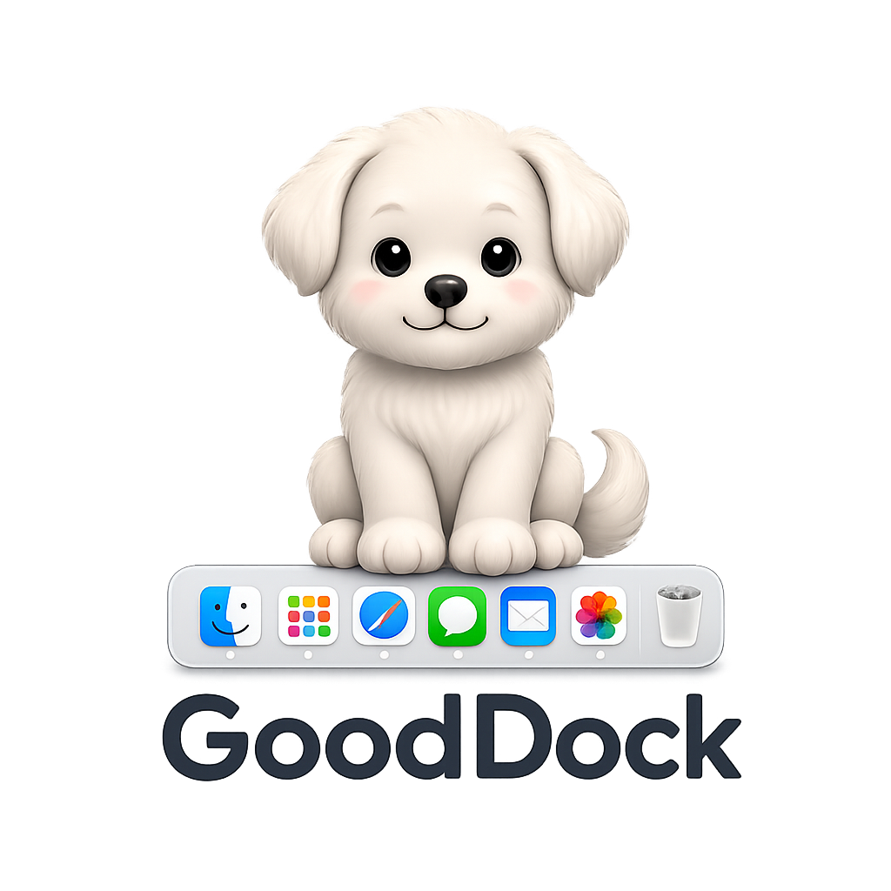

<p align="center">
  
</p>

<h1 align="center">GoodDock</h1>

<p align="center"><em>"Sit. Stay. Good boy."</em><br>
A menu bar app that keeps the macOS Dock on the display you choose.</p>

<p align="center">
  <a href="https://github.com/Seo-yul/GoodDock/releases/latest"><b>⬇︎ Download</b></a> ·
  <a href="https://devops.ai.kr/GoodDock/">Website</a> ·
  <a href="README.ko.md">한국어</a>
</p>

---

## Why this exists

With more than one display, the macOS Dock never stays put. Push the pointer to the bottom of any screen and the Dock follows it there. You lower the mouse for a second, and the Dock has moved to the next monitor. To bring it back, you push again.

macOS offers only two settings, and neither solves it. Turn off "Displays have separate Spaces" and the Dock stays put, but every monitor now switches Spaces together, which is worse. Leave it on and Spaces stay independent while the Dock wanders.

GoodDock fills the gap. Pick one display, and the Dock stays there. Spaces keep working per display, exactly as before.

## How it works

macOS has no API to pin the Dock to a display. So instead of moving the Dock, GoodDock removes the condition that makes it move.

The Dock is summoned when a pointer already resting at the bottom edge of a screen is pushed down once more. GoodDock watches mouse events and, the moment it sees that push on a display you did not pin, nudges the pointer a few pixels back up. The pointer can never sit against the bottom edge, so the Dock is never called.

Edges where another display continues below are excluded automatically, so moving the pointer between monitors is never affected.

## Features

- Lives in the menu bar as a small dog icon and takes no Dock space
- Pick the pinned display by clicking a scaled map of your actual monitor layout
- Detects monitors being connected, disconnected, or rearranged
- Shows whether it is running, and how many Dock moves it has blocked
- Optional launch at login
- Choose "Don't pin" at any time to restore the default behavior

## Install

Requires macOS 13 or later.

Download the DMG from [Releases](https://github.com/Seo-yul/GoodDock/releases/latest), open it, and drag GoodDock into your Applications folder.

This app is not signed with an Apple Developer certificate, so Gatekeeper blocks it the first time. **Right-click the app and choose "Open"**, then confirm with "Open" once more. After that it launches normally. If it still refuses to open, clear the quarantine attribute:

```bash
xattr -dr com.apple.quarantine /Applications/GoodDock.app
```

### First run

GoodDock asks for Accessibility permission on first launch. Allow it under System Settings > Privacy & Security > Accessibility. The app detects the change and starts working immediately.

Then click the dog in the menu bar and pick the display where the Dock should stay. If the top of the menu reads "작동 중" (running), you are set.

> **Note:** "Displays have separate Spaces" (System Settings > Desktop & Dock > Mission Control) must stay **on**. Turning it off ties every monitor to the same Space, which is the very problem this app exists to avoid.

## Uninstall

Quit GoodDock and move `/Applications/GoodDock.app` to the Trash. To remove its settings as well:

```bash
defaults delete kr.ai.devops.gooddock
tccutil reset Accessibility kr.ai.devops.gooddock
```

## Good to know

- On displays that are not pinned, pressing the pointer into the very bottom 2 pixels is slightly restricted. That is the cost of blocking the Dock, and it does not affect normal clicking.
- Quitting the app restores everything instantly. It never changes your system settings.
- The only value it stores is the UUID of your pinned display, in `~/Library/Preferences/kr.ai.devops.gooddock.plist`.
- It makes no network connections.

## About the name

The Dock kept running off, so it got some training. Now it sits where it is told and waits. A good Dock. GoodDock.

## Feedback

Bug reports and feature requests are welcome in [Issues](https://github.com/Seo-yul/GoodDock/issues).

Made by [Yoon Seoyul](https://www.linkedin.com/in/yoon-seoyul).

## License

Free to use, personally or at work, at no cost.

The copyright holder reserves all rights, and **modification, redistribution, and commercial exploitation are not permitted.** See [LICENSE](LICENSE) for the full terms.
